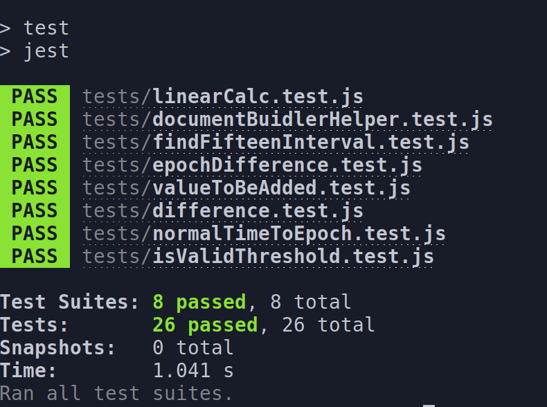

Author: NAU IoT (D'Yanni Bigham)
# Introduction 
This is a project that that was motivated by the Living Dashboard project. It is a project that takes raw data from a mqtt feed of NAU'a buildings utility usage and normalize it in a more user friendly way. It can be used on its own or within another application.

# Getting Started
## Installation process

To install this program, a few prerequites are required to run successfully. Once those are met, this repo can be cloned and the program can be ran.

### Prerequsites

[Node.js/Node Package Manager (NPM)](https://nodejs.dev/learn)

[MongoDB](https://www.mongodb.com/what-is-mongodb)

#### Node.js/NPM Installation

The instructions for installing Node.js/NPM are depedent on which OS is being used. Follow the link below and choose the installion process for your OS.

- **Note**: It is recommend to install the Long-Term-Support(LTS) version for the best performance and stability.

- [Node.js Installation](https://nodejs.org/en/download/)

#### MongoDB Installation 

The instructions for installing MongoDB is depedent on which OS is being used. Follow the link below and choose the installion process for your OS.
- [MongoDB Installation](https://www.mongodb.com/docs/manual/installation/)

Few things to note
1. Under MongoDB Manual on the left hand side make sure it says (number) current
2. Install the Comunnity Edition of MongoDB


## Software Dependencies
This program is writen in JavaScript and requires the following dependencies:

1. [dayjs](https://day.js.org/en/)<br>
```
npm install dayjs
```
2. [Jest](https://jestjs.io/)<br>
```
npm install --save-dev jest
```
##	Latest releases

### Version 1.0 (06/06/2022)
The data normalization procedure successfully works with the data in the ‘bacnetgw1’ MongoDB collection on cscap1. 

The procedure then goes through each data point from the ‘bacnetgw1’ collection and normalizes it accordingly. It also checks for any outages that might have occurred.

The normalized data is then stored within a new collection called `quarter_hour`.


# Build and Test

## Enable Mongo Service
Before running the program, MongoDB service must first be enabled. The command for this is dependent on the OS being used. The following example is done in an Ubtuntu-based system using systemd.

```
sudo systemctl start mongod
```
## Running the Program
To run the program, Run the following the command
```
node driver.js
```
**Note**: There is no expected output. Debugging statements may be used to verify normlaizaion operations. 

## Testing the Program
Before testing the program add this to the `package.json` file 
```
  "scripts": {
    "test": "jest"
  }
  ```

  Run the following command to test the program
  ```
  npm test
  ```

  Here is the output of the above command:

  
# Contribute
Here's a list of improvements that could be taken as next steps:
1. Refactor findFifteenInterval to call out when the repair module needs to activate. This will clean up documentBuilder substantially and improve readability.
2. Containerize the application with Docker.
3. Experiment with the idea of toggling debug logging on different levels for variable numbers of output.
4. Create a final summary of the run as a log at the end of program execution (debug output can be the more verbose version).
